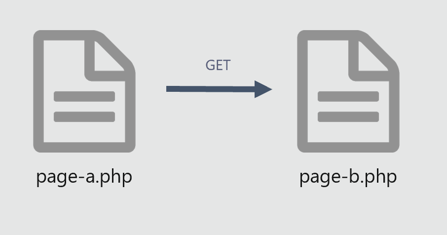

# Module 3 Installation


## Utiliser GET pour envoyer des données
***page-a.php***
```html
<a href="page-b.php?nom=PITT&prenom=Brad&age=42" > lien </a>
```

***page-b.php***
```php
<?php
if (isset($_GET['nom'])){
    $nom =$_GET['nom'];
    echo $nom."<br>";
}
if (isset($_GET['prenom'])){
    $prenom =$_GET['prenom'];
    echo $prenom."<br>";
}
if (isset($_GET['age'])){
    $age =$_GET['age'];
    echo $age."<br>";
}
```

pour debuger ;
***page-b.php***
```php
<?php
var_dump($_GET)
```

pour debuger ;
***page-b.php***
```php
<?php
print_r($_GET);
```
