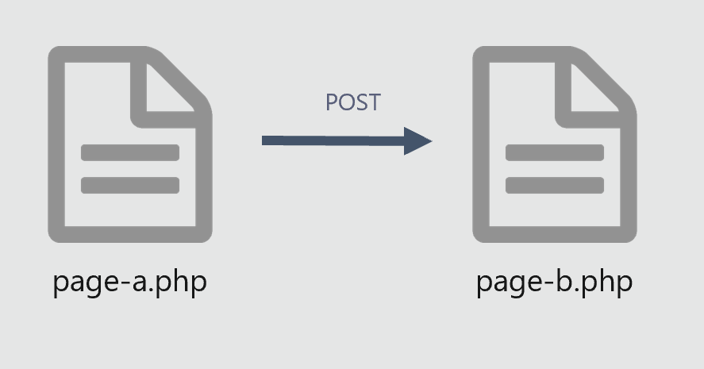

# Module 4 Méthode POST


## Utiliser GET pour envoyer des données
***page-a.php***
```html
<form method="post" action="page-b.php">
    <input name="prenom"><br>
    <input name="nom"><br>
    <input name="age"><br>
</form>
```

***page-b.php***
```php
<?php
if (isset($_POST['nom'])){
    $nom =$_POST['nom'];
    echo $nom."<br>";
}
if (isset($_POST['prenom'])){
    $prenom =$_POST['prenom'];
    echo $prenom."<br>";
}
if (isset($_POST['age'])){
    $age =$_POST['age'];
    echo $age."<br>";
}
```

pour debuger ;
***page-b.php***
```php
<?php
var_dump($_POST)
```

pour debuger ;
***page-b.php***
```php
<?php
print_r($_POST);
```
