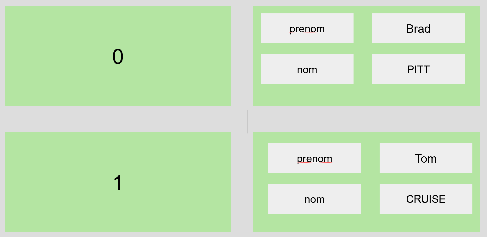

# TP 02 Excercice sur les tableaux

Doc php **array** les tableaux  
https://www.php.net/manual/en/ref.array.php

## Excercice 1

Créer ce tableau 2 dimenssions   
et l'afficher avec un boucle foreach  en HTML

## Excercice 2
Créer un tableau d’entiers variant de 1 à 63, puis, à partir de celui-ci, un autre tableau 
de nombres variant de 0 à 6.3.  
Créer ensuite un tableau associatif dont les clés X varient de 0 à 6.3 et dont les valeurs 
sont sin(X).  
Afficher ce tableau dans un tableau HTML.

**Objectif 1 :**  
| indice  | valeur | 
| :--------------- |:---------------:|
| 0 | 0 |
| 1 | 1 |
| 2 | 2 |
| 3 | 3 |
| ... | ... |
| 61 | 61 |
| 62 | 62 |
| 63 | 63 |

**Objectif 2 :**  
| indice  | valeur | 
| :--------------- |:---------------:|
| 0 | 0 |
| 1 | 0.1 |
| 2 | 0.2 |
| 3 | 0.3 |
| ... | ... |
| 61 | 6.1 |
| 62 | 6.2 |
| 63 | 6.3 |

**Objectif 3 :**
Tableau de valeurs de la fonction sinus :  

| X  | sin (x) | 
| :--------------- |:---------------:|
| 0 | 0 |
| 0.1 | 0.099833416646828 |
| 0.2 | 0.19866933079506 |
| 0.3 | 0.29552020666134 |
| ... | ... |
| 6.1 | -0.1821625042721 |
| 0.2 | -0.083089402817496 |
| 0.2 | 0.01681390048435 |

## Excerice 3

| Indice  | Valeur | 
| :--------------- |:---------------:|
| 0 | hello@sfr.fr |
| 1 | marc@sfr.fr |
| 2 | estelle@sfr.fr |
| 3 | caroline@sfr.fr |
| 4 | hello@orange.fr |
| 5 | goodbye@orange.fr |
| 6 | justine@orange.fr |
| 7 | hello@free.fr |
| 8 | bob@free.fr |

Créer un tableau contenant une liste d’adresses e-mail.  
Extraire le nom de serveur de ces données puis réaliser des statistiques sur les occurrences de chaque fournisseur d’accès. 

**Objectifs :**

| Indice  | Valeur | 
| :--------------- |:---------------:|
| @sfr.fr | 5 |
| @orange.fr | 3 |
| @free.fr | 2 |

| Indice  | Valeur | 
| :--------------- |:---------------:|
| @sfr.fr | 50% |
| @orange.fr | 30% |
| @free.fr | 20% |

