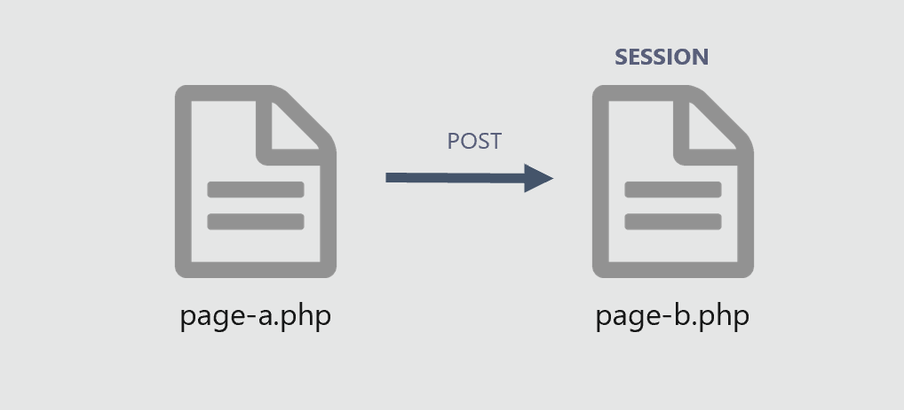
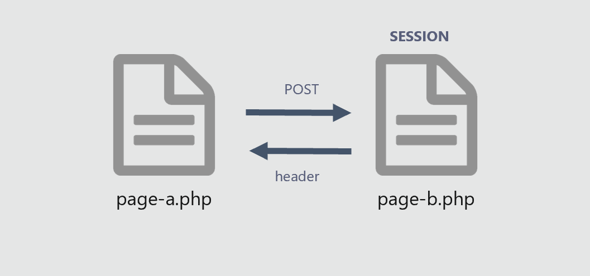

# 09 Les sessions



## Comment utiliser les sessions en PHP ?   
**demo :**
- page-a.php  
- page-b.php  
- vider.php  
  

### ETAPE 1 envoyer des données

**page-a.php**  

```php
<form method="post" action="page-b.php">
    <input name="nom_film"><br>
    <input name="annee"><br>
    <button type="submit">GO</button>
</form>
```

**page-b.php**  
```php
<?php
session_start();  // ne pas oublier de demarrer la session!
if (isset($_POST["nom_film"]) && isset($_POST["annee"])){
	$nom_film = $_POST["nom_film"];
    $annee =$_POST["annee"];
    $tab["nom_film"] =$nom_film; // je stocke dans un tableau
    $tab["annee"] =$annee;
    // $_SESSION["films"] devient un tableau 2 dimmensions
    $_SESSION["films"][] = $tab; // je stocke dans un tableau de session
    // je redirige vers un autre page
    header("Location:page-b.php");
}

```
### ETAPE 2 J'affiche les données en session


**page-a.php**  
  
```php
<?php 
    // doit etre en premien dans la page
    // avant la balise <!DOCTYPE html>
    session_start(); 
?>
<form method="post" action="page-b.php">
    <input name="prenom"><br>
    <input name="nom"><br>
    <button type="submit">GO</button>
</form>
<a href="vider.php">vider la session</a><br><br>
<?php 
   // si il y a qlq chose en session
   if (isset ($_SESSION["films"])):
    $films =$_SESSION["films"];
   foreach ($films as $tab):
?>
<p>
    <?=$tab["nom_film"]?> - <?=$tab["annee"]?><br>
</p>
<?php 
    endforeach;
    endif; 
?>
```

### ETAPE 3  vider la session 
```php
<?php
session_start();
session_unset();
session_destroy();
header("location:page-a.php");
```

**documentation session**   
https://www.php.net/manual/en/reserved.variables.session.php  
**documentation header**  
https://www.php.net/manual/en/function.header.php  

