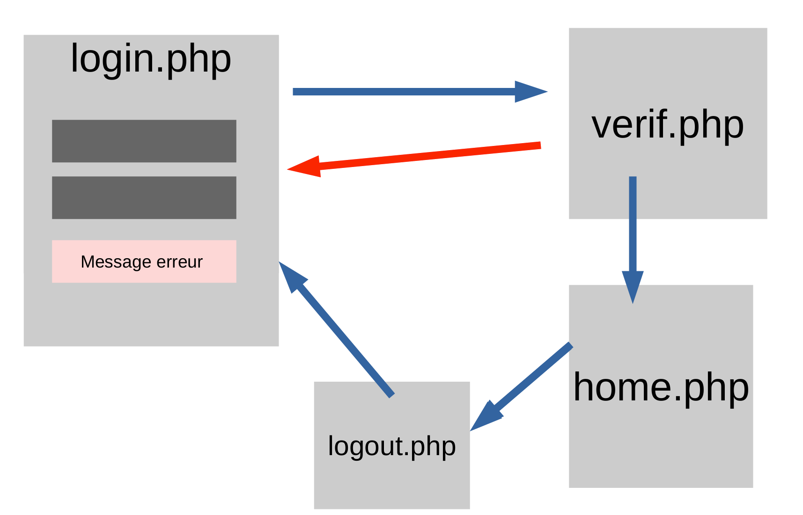

# 10 - TP 03 Mise en place d'une authentification
  
  
A partir des 4 fichiers mettre en place une authentification
- login.php  
- verif.php  
- home.php  
- logout.php  
  
**objectif** 
  
- afficher le message d'erreur 
- Vérifier la validité mot du login et mot de passe  
- rediriger vers la page home.php si tout est ok  
- activer le lien logout de la home.php  
- bloquer l'accés de la page home.php si vous tapé l url dans le navigateur  

