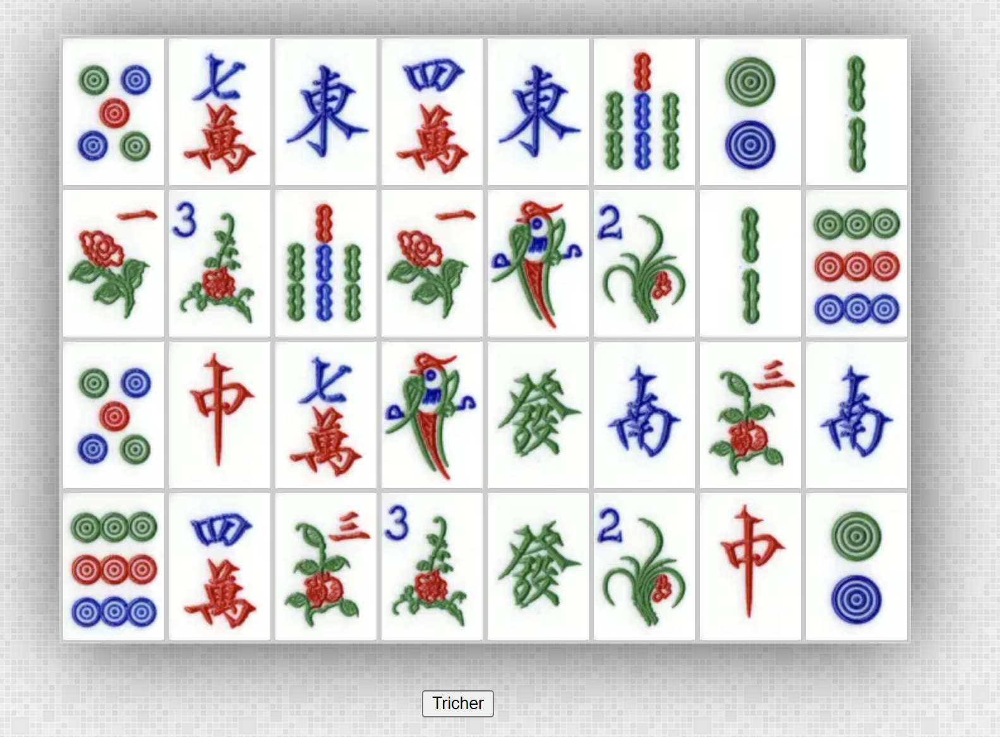

# 12 - TP 05 Memory le Majhong
  

démo live en **JavaScript**:
[demo en javascript](https://seven-valley.github.io/formation-php-mai-2024/web/tp12/)


A partire du répertoire ressources 

## Objectifs :

**etape 1**  
 afficher en php les tuiles de 1 à 32  
**le fichier etape1.php est fait !**

**etape 2**  
 afficher les tuiles de 1 à 32 mélangées  

**etape 3**  
 afficher 16 paires de tuiles(prises parmis les 42 tuiles)  mélangées  

**etape 4**  
effacer une tuile  

**etape 5**  
effacer les 2 mêmes tuiles  

**etape 6**  
éviter le bug quand on clique 2 fois sur la meme tuile  

## Pour bien commencer :

Une tuile doit être ajouter comme cela  
```html
<div></div>
```
Pour afficher plusieurs tuiles  
Vous devez les rajouter dans la balise **container** 

```html
<div class="container">
		<div></div>
		<div></div> <!-- tuile cachée -->
		<div></div>
</div>
```