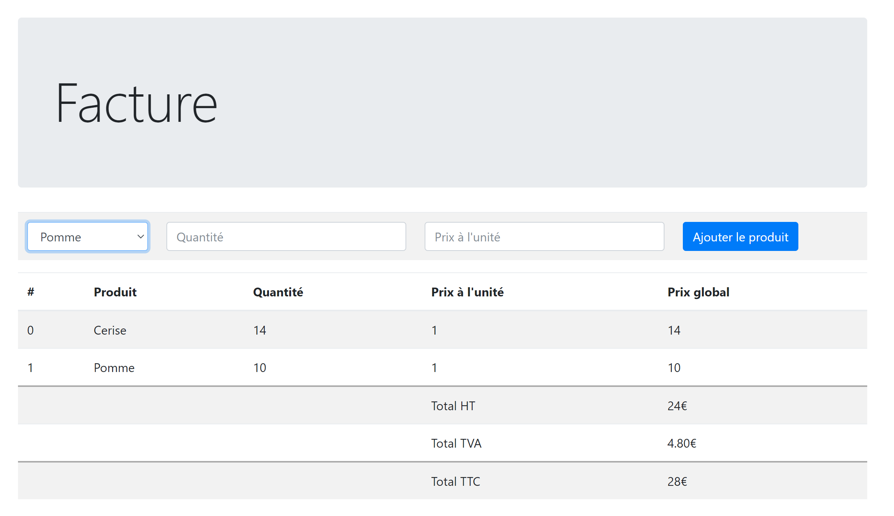

# 13 - TP 06 Factures

démo live en **JavaScript**:
[demo en javascript](https://seven-valley.github.io/formation-php-mai-2024/web/tp13/)

A partir de la maquette :  

**ojectif**

- saisir le fruit  
- saisir la quantité  
- saisir le prix unitaire hors taxe  
- afficher le total Hors Taxe  
- affciher la TVA  
- afficher le total TTC  
